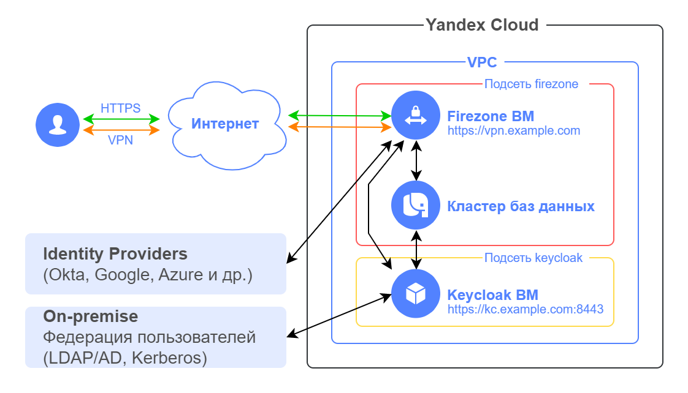

# Remote access VPN based on WireGuard

## Contents
- [About the solution](#описание-решения)
- [Preparing for deployment](#подготовка-к-развертыванию)
- [Deploying Terraform configuration](#развертывание-terraform-сценария)
- [Configuring Firezone](#настройка-firezone)
- [Health check](#проверка-работоспособности)
- [Requirements for production deployment](#требования-к-развертыванию-в-продуктивной-среде)
- [Deleting the created resources](#удаление-созданных-ресурсов)

## About the solution

This solution deploys cloud infrastructure in Yandex Cloud to set up a remote access [WireGuard](https://www.wireguard.com/)-based VPN that enables secure user access to cloud resources. This deployment supports multiple popular identity providers for user single sign-on scenarios in a corporate user identity federation.

While deploying this solution, you will be creating the following components in Yandex Cloud:

| Name | Description |
| ---- | ---- |
| Firezone VM | Open-source [Firezone](https://www.firezone.dev/) based on WireGuard VPN to set up VPN access. |
| Database cluster | [Managed Service for PostgreSQL](https://yandex.cloud/services/managed-postgresql) to run Firezone and Keycloak VMs. | 
| Keycloak VM | Open-source [Keycloak](https://www.keycloak.org/) software for user single sign-on authentication in a corporate user identity federation, such as Active Directory. |



### Firezone

[Firezone](https://www.firezone.dev/) is an open-source solution for setting up a remote access VPN with the following features:
- Support for the latest [WireGuard VPN](https://www.wireguard.com/) protocol with desktop and mobile [clients](https://www.wireguard.com/install/).
- User authentication:
    - Local authentication by email and password.
    - Single sign-on integration with an identity provider via OpenID Connect (OIDC) or SAML 2.0.
    - Multi-factor authentication.
- Intuitive admin web interface to configuring and managing users and their devices.
- User web interface for authentication and managing their devices.
- Deployment in the form of a Docker container.

Firezone supports multiple popular identity providers for [user authentication](https://www.firezone.dev/docs/authenticate/). This solution uses Keycloak as an example.

Here are the steps for a user to connect to the VPN:
1. The user installs the [WireGuard client](https://www.wireguard.com/install/) on their device. 
2. The user gets the configuration file for the WireGuard app using one of the following methods:
    - Using the Firezone admin web interface, the administrator adds the user’s device, downloads the WireGuard configuration file, and sends it to the user via a secure channel.
    - After successful authentication in the Firezone web interface, the user can add their device to establish a VPN connection from and download the WireGuard configuration file on their own. This is the best practice to follow in Firezone. 
3. The user imports the configuration file into the WireGuard app.
4. The user activates the VPN tunnel.

Firezone has a specific [user guide](https://www.firezone.dev/docs/user-guides/client-instructions/) on how to connect to the VPN.

For more info on Firezone, see: 
- [Firezone documentation](https://www.firezone.dev/docs/)
- [Firezone GitHub repository](https://github.com/firezone/firezone)


## Preparing for deployment

1. Before you start deployment, [sign up for Yandex Cloud and create a billing account](https://yandex.cloud/docs/tutorials/infrastructure-management/terraform-quickstart#before-you-begin).

2. [Install Terraform](https://yandex.cloud/docs/tutorials/infrastructure-management/terraform-quickstart#install-terraform).

3. Check if there is an account in the cloud with the `admin` permissions for the folder.

4. [Install and configure the Yandex Cloud CLI](https://yandex.cloud/docs/cli/quickstart).

5. [Install Git](https://github.com/git-guides/install-git).

6. Check that your cloud quotas allow you to deploy your resources in this use case:

    <details>
    <summary>View info on the amount of resources created in this use case</summary>

    | Resource | Amount |
    | ----------- | ----------- |
    | Virtual machines | 2 |
    | VM vCPUs | 4 |
    | VM RAM | 12 GB |
    | Disks | 2 |
    | SSD size | 110 GB |
    | Subnets | 2 |
    | Static public IP addresses | 2 |
    | Security groups | 2 |
    | Certificate Manager certificate | 1 |
    | DNS zone | 1 |
    | Managed Service for PostgreSQL cluster | 1 |
    | SSD storage capacity per PostgreSQL cluster | 10 GB |
    | Number of vCPUs for PostgreSQL cluster | 2 |
    | Amount of RAM per PostgreSQL cluster | 8 |    

    </details>


7. Before deploying the solution, make sure the following objects are available:
    - Cloud resource folder and VPC network in Yandex Cloud for hosting the solution components.
    - Domain to use for the Firezone and Keycloak VMs. Make sure to first delegate this domain to Yandex Cloud from the domain registrar. For this, specify the addresses of the Yandex Cloud name servers in your registrar's NS records:
        ```
        ns1.yandexcloud.net.
        ns2.yandexcloud.net.
        ```

## Deploying Terraform configuration

1. Clone the `yandex-cloud-examples/yc-remote-acess-vpn-with-wireguard-firezone` GitHub [repository](https://github.com/yandex-cloud-examples/yc-remote-acess-vpn-with-wireguard-firezone/) to your local machine and go to the `yc-remote-acess-vpn-with-wireguard-firezone` directory:

    ```bash
    git clone https://github.com/yandex-cloud-examples/yc-remote-acess-vpn-with-wireguard-firezone.git

    cd yc-remote-acess-vpn-with-wireguard-firezone
    ```

2. Set up the deployment environment (see the details [here](https://yandex.cloud/docs/tutorials/infrastructure-management/terraform-quickstart#get-credentials)):

    ```bash
    export YC_TOKEN=$(yc iam create-token)
    ```

3. Enter your custom values in the `output.tf` file located in the `settings` directory. Refer to the table below to see which parameters are required to update.

    <details>
    <summary>View detailed info on the values to enter</summary>

    | Name | Description | Type | Example | Change required |
    | ----------- | ----------- | ----------- | ----------- | ---------- |
    | domain | Domain name (second and first-level, separated with a period) for the Firezone and Keycloak VMs. | `string` | `"example.com"` | Yes |
    | folder_id | ID of the folder to host the solution components. | `string` | `"b1gentmqf1ve9uc54nfh"` | Yes |
    | vpc_id | ID of the cloud network to host the solution components. | `string` | `"enp48c1ndilt42veuw4x"` | Yes |
    | trusted_ip_for_mgmt | List of public IP addresses or subnets trusted to connect to the Firezone and Keycloak VMs over SSH. It is used in the incoming security group rule.  | `list(string)` | `["A.A.A.A/32", "B.B.B.0/24"]` | Yes |
    | **firezone** | | | | |
    | subdomain | Subdomain for the Firezone VM. | `string` | `"vpn"` | |
    | subnet | Subnet CIDR value for the Firezone VM. | `string` | `"192.168.1.0/24"` |  |
    | vm_username | Firezone VM username. | `string` | `"admin"` |  |
    | admin_email | Admin email address (login) to access the Firezone admin web UI. | `string` | `"admin@example.com"` | Yes |
    | version | Firezone deployment [version](https://github.com/firezone/firezone/releases). | `string` | `"0.7.32"` | |
    | wg_port | UDP port for the WireGuard protocol. | `string` | `"51820"` | |
    | **postgres** | | | | |
    | db_ver | PostgreSQL cluster version used to store the Firezone and Keycloak data. | `string` | `"15"` | |
    | db_user | PostgreSQL cluster username. | `string` | `"dbadmin"` | |
    | db_kc_name | Name of the database for storing Keycloak data in the PostgreSQL cluster. | `string` | `"kc-db"` | |
    | db_firezone_name | Name of the database for storing Firezone data in the PostgreSQL cluster. | `string` | `"firezone-db"` | |
    | **keycloak** | | | | |
    | subdomain | Subdomain for the Keycloak VM. | `string` | `"kc"` | |
    | subnet | Subnet CIDR value for the Keycloak VM. | `string` | `"192.168.2.0/24"` | |
    | port | Number of the port for accessing the Keycloak VM over HTTPS. | `string` | `"8443"` | |
    | image_folder_id | ID of the folder with the Keycloak image. | `string` | `"b1g4n62gio32v96mdvrb"` | No |
    | image_name | Keycloak image name. | `string` | `"keycloak"` | No |
    | vm_username | Keycloak VM username. | `string` | `"admin"` | |
    | admin_user | Admin name (login) to access the Keycloak admin web UI. | `string` | `"admin"` | |
    | le_cert_name | Keycloak certificate name in Yandex Certificate Manager. | `string` | `"kc"` | |
    | test_user | Test user for verifying SSO in Keycloak and VPN connection.  | | | |
    | name | Test user name (login) for verifying SSO in Keycloak. | `string` | `"user"` |  |
    | email | Test user email address to add to Firezone after successful authentication in Keycloak. | `string` | `"user@example.com"` | Yes |
    
    </details>

4. Go to the `main` directory:

    ```bash
    cd main
    ```

5. Initialize Terraform:

    ```bash
    terraform init
    ```

6. Check the list of cloud resources you are about to create:

    ```bash
    terraform plan
    ```

7. Create resources:

    ```bash
    terraform apply
    ```
	
    Wait until the resources are created. It may take up to 30 minutes to process a request for a Let's Encrypt certificate. 

8. Once `terraform apply` is complete, the command line will output the URLs for connecting to the Firezone and Keycloak web interfaces, as well as the admin credentials for both Firezone and Keycloak. Later on, you can view this information by running the `terraform output` command.

    <details>
    <summary>Viewing information on deployed resources</summary>

    | Name | Description | Sample value |
    | ----------- | ----------- | ----------- |
    | `firezone_admin_credentials` | Firezone admin credentials | `"admin_email" = "admin@example.com"`<br>`"admin_password" = "EP!f#YAfdaxd"` |
    | `firezone_url` | Firezone web UI URL | `"https://vpn.example.com"` |
    | `keycloak_admin_credentials` | Keycloak admin credentials | `"admin_username" = "admin"`<br>`"admin_password" = "Ns?3lvB*HvHD"` |
    | `keycloak_url` | Keycloak web UI URL | `"https://kc.example.com:8443/admin"` |

    To output a sensitive value, specify it in the `terraform output` command, e.g., `terraform output firezone_admin_credentials`.

    </details>

9. After you deploy the Firezone and Keycloak VMs, go to the `keycloak-config` directory to set up Keycloak for integration with Firezone and single sign-on.

    ```bash
    cd ../keycloak-config
    ```

10. Initialize Terraform:

    ```bash
    terraform init
    ```

11. Check the list of cloud resources you are about to create:

    ```bash
    terraform plan
    ```

12. Create resources:

    ```bash
    terraform apply
    ```

13. Once the `terraform apply` process is complete, the command line will show information for Firezone and Keycloak integration setup and test user credentials to test SSO in Keycloak and connect to the VPN. Later on, you can view this information by running the `terraform output` command.

    <details>
    <summary>View info on deployed resources</summary>

    | Name | Description | Sample value |
    | ----------- | ----------- | ----------- |
    | `keycloak_config_for_firezone` | Parameters for setting up integration between Firezone and Keycloak. | `"client_id" = "firezone"`<br>`"client_secret" = "Wxy2nthDXiMD42xmcD2mLgGxtjWbSDDc"`<br>`"discovery_document_uri" = "https://kc.example.com:8443/realms/firezone/.well-known/openid-configuration"` |
    | `test_user_credentials` | Test user account for verifying SSO in Keycloak and VPN connection. | ` "test_user_name" = "user"`<br>`"test_user_password" = "IfV6OvIKqzzn"` |
    
    To output a sensitive value, specify it in the `terraform output` command, e.g., `terraform output test_user_credentials`.
    
    </details>

14. Once you have set up Keycloak using Terraform, proceed to [configuring Firezone](#настройка-firezone).

## Configuring Firezone

1. In your browser, go to `https://firezone_url`, where `firezone_url` is the `terraform output firezone_url` command output in the `main` directory.
2. Log in to the Firezone admin interface using the admin credentials from the `terraform output firezone_admin_credentials` command output in the `main` directory.
3. Go to `SETTINGS -> Defaults` to change the default values.
4. In the `Allowed IPs` field, specify the cloud subnet IP addresses (as a comma-separated list of subnet IPs/masks) for which VPN clients will route traffic to the VPN tunnel, e.g., `192.168.1.0/24, 192.168.2.0/24`.
5. In the `DNS Servers` field, specify the DNS server addresses for VPN clients to use. If you are not going to reassign these DNS addresses on the client side, delete the info in this field. Here is an example: `192.168.1.2, 192.168.2.2`.
6. You can also change the default parameters for the `keepalive` interval and MTU size for VPN clients. The default MTU size is 1280 bytes; you can increase it to 1440 bytes.
7. Click `Save` to apply the settings.
8. Go to `SETTINGS -> Security` to change security settings.
9. Disable `Allow unprivileged device configuration` so that the user cannot change the VPN client network settings through the Firezone user web UI.
10. Enable the `Auto disable VPN` setting. This will allow disabling a user's VPN connections when the user is removed in the identity provider (in this case, Keycloak).
11. Click `Add OpenID Connect Provider` to add Keycloak.
12. Under `OIDC Configuration`, fill in the following fields:
    - `Config ID`: `keycloak`
    - `Label`: `Keycloak`
    - `OIDC scopes`: `openid email profile offline_access`
    - `Client ID`: `firezone`
    - `Client secret`: `client_secret` from the `terraform output keycloak_config_for_firezone` output in the `keycloak-config` directory (specify the value without quotes).
    - `Discovery Document URI`: `discovery_document_uri` from the `terraform output keycloak_config_for_firezone` output in the `keycloak-config` directory (specify the value without quotes).
    - `Redirect URI`: Leave it blank.
    - Enable `Auto-create users` to automatically add users to Firezone after their successful authentication in Keycloak.
13. Click `Save` under `OIDC Configuration` to apply the settings.

## Health check

1. Download the [WireGuard client](https://www.wireguard.com/install/) from the WireGuard website and install it on your device. For further steps to set up the WireGuard client, we will use Windows as an example. For other operating systems, the names of UI elements may differ.

2. In your browser, go to `https://firezone_url`, where `firezone_url` is the `terraform output firezone_url` command output in the `main` directory. If you have an active admin session in the Firezone web interface, `Log Out` first. Click `Sign in with Keycloak`. You will be redirected to the Keycloak web page for single sign-on.

3. Log in using the test user credentials from the `terraform output test_user_credentials` command output in the `keycloak-config` directory.

4. After successful authentication in the Firezone web interface as the test user, add a device to establish a VPN connection from. To do this, click `Add Device`.

5. In the window that opens, you can change the device name and add its description. Click `Generate Configuration`.

6. This will open a window with the device's VPN configuration. Click `Download WireGuard Configuration` to download the configuration file. You can also use the WireGuard app for Android or iOS to scan a QR code from this page to add a VPN tunnel.

    **Important:** Do not close this window until you have downloaded the configuration file or scanned the QR code. You will not be able to view the device's VPN configuration in the Firezone web interface once you close the window.

7. Add a new VPN tunnel (`Import tunnel(s) from file`) in the WireGuard app using the configuration file you downloaded.

8. Click `Activate` to activate the tunnel.  

9. Use `ping 192.168.1.1` in the command line on your device to check whether the gateway is accessible from the `firezone` cloud subnet. You are now connected to the cloud infrastructure through the VPN tunnel.

## Requirements for production deployment

- Make sure to change the Firezone and Keycloak admin passwords.
- After the health check is complete, delete the test user from Keycloak and Firezone.
- Save the `pt_key.pem` private SSH key to a secure location or recreate it without Terraform.

## Deleting the created resources

To delete resources created using Terraform:

1. On your workstation, go to the `keycloak-config` directory and run the `terraform destroy` command.
2. Next, go to the `main` directory and run `terraform destroy` again.

> **Important**
> 
> Terraform will **permanently** delete all resources created in this use case.

